# AcademiQ 🎓 
### The Ultimate Student Command Center
*By Students, For Students*

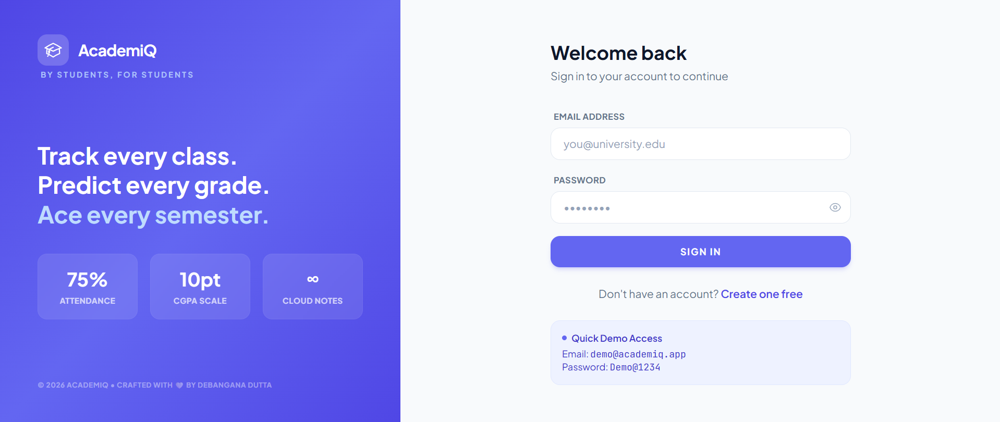 

AcademiQ is a production-grade MERN stack application designed to help students navigate university life with data-driven precision. From attendance skip-logic to interactive CGPA simulation, it serves as the ultimate workspace for academic excellence.

---

## 📸 Visual Tour

### ⚡ The Command Center (Dashboard)
**Your academic life, at a glance.**
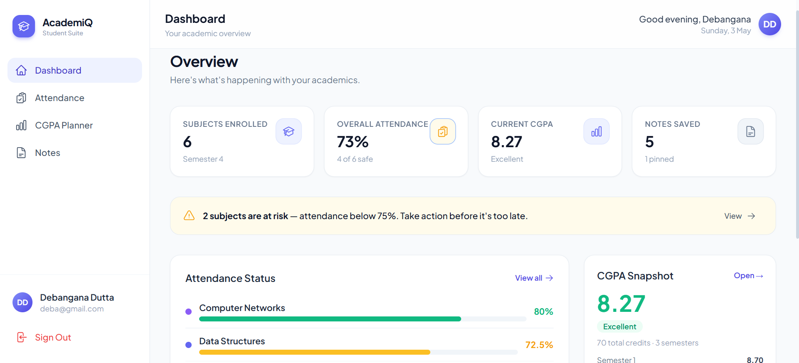
Stop juggling multiple apps. The AcademiQ Dashboard provides a high-fidelity summary of your semester. It automatically flags subjects at risk, tracks your recent notes, and calculates your cumulative attendance health in real-time so you stay ahead of the curve.

### 🧠 Attendance Intelligence
**Master your schedule with mathematical precision.**
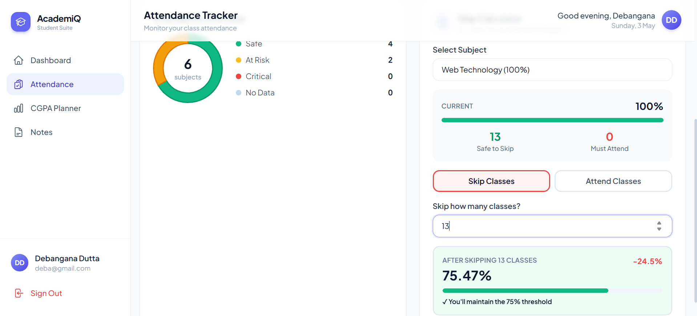
Never stress about the 75% rule again. Our advanced analytics engine provides a high-level overview of your semester intelligence, categorizing subjects into "Safe" and "At Risk" zones based on real-time data tracking. Data-driven freedom for the modern student.

### 🔮 Predictive Results (CGPA Simulator)
**See the future of your grades before you even sit for exams.**
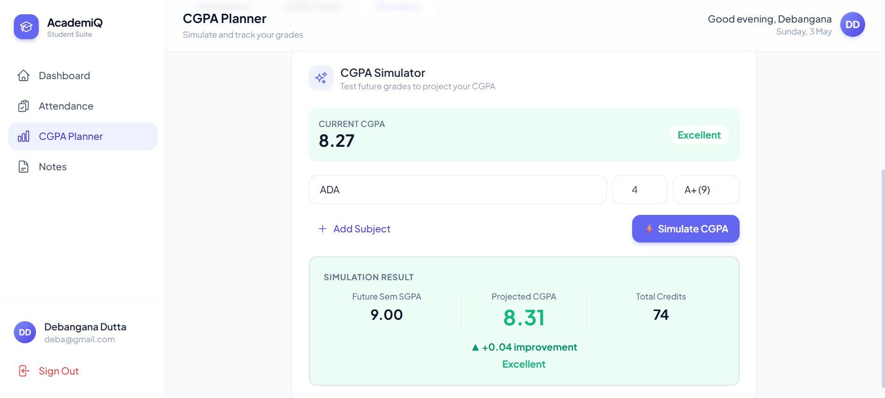
Take control of your academic destiny. This interactive module allows you to input prospective subjects, credits, and expected grades to instantly see their impact. It provides a real-time "Simulation Result" highlighting your Projected CGPA and the exact point improvement required to reach your goals.

### 📊 Performance Analytics
**Predict your future, track your growth.**
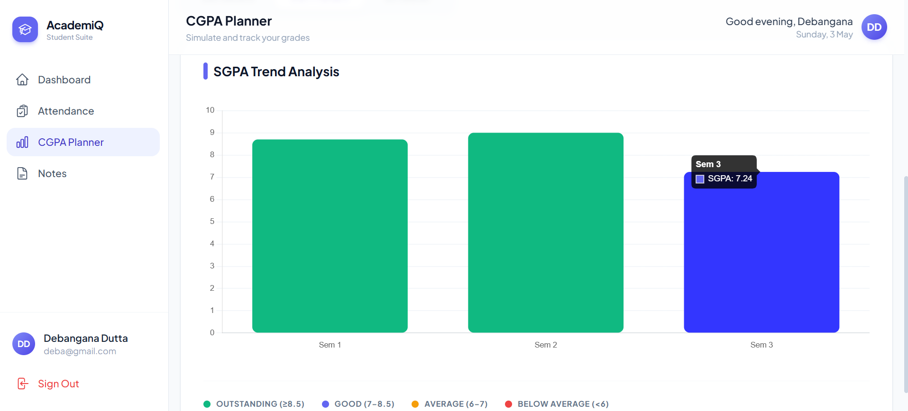
Visualize your academic journey with interactive SGPA trend charts. Use our predictive simulator to input "what-if" grades for upcoming exams and see their immediate impact on your final degree percentage before you even sit for the test.

### 📝 The Academic Vault (Notes)
**Knowledge organized, effortlessly searchable.**
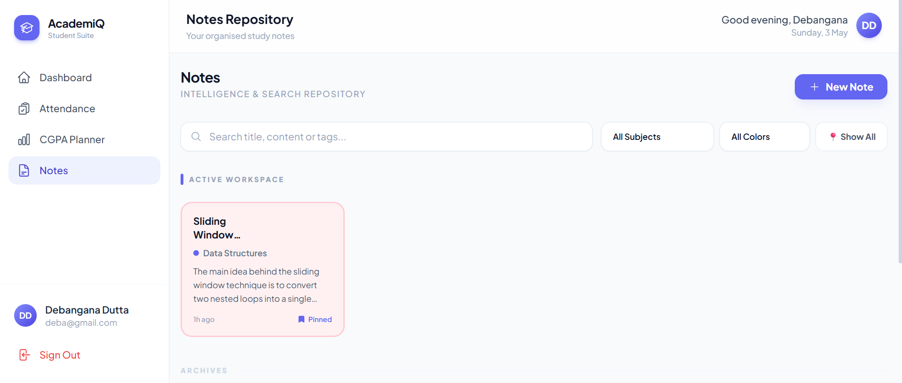
A sleek, categorized repository for your study materials. With 6 professional color palettes, subject-wise tagging, and a "Pinned" workspace for high-priority exam notes, your intellectual property has never looked this organized.

---

## 🖼️ Module Gallery
*A technical deep-dive into the sub-components.*

| Attendance Logs | Note Editor | CGPA Semester Entry |
| :---: | :---: | :---: |
| 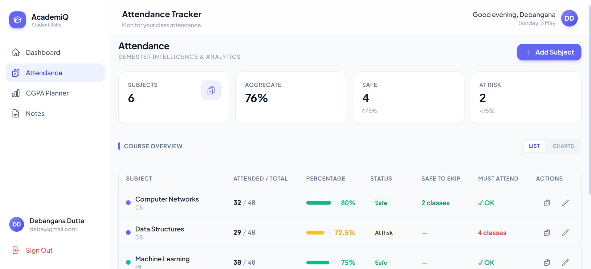 | 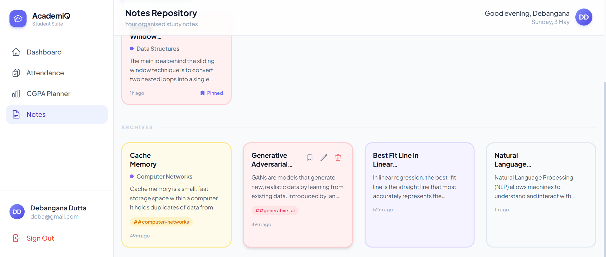 | 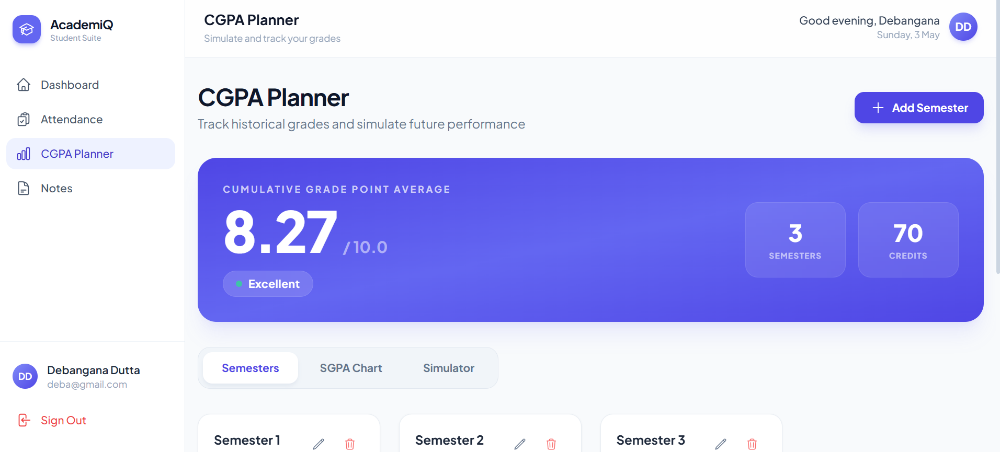 |
| **History Tracking**: Detailed date-stamped logs of every class attended or missed. | **Rich Editor**: Distraction-free writing environment with subject-specific tagging. | **Grade Entry**: Streamlined interface for managing multi-semester results. |

| SGPA Breakdown | Subject Details | Predictive Attendance |
| :---: | :---: | :---: |
| 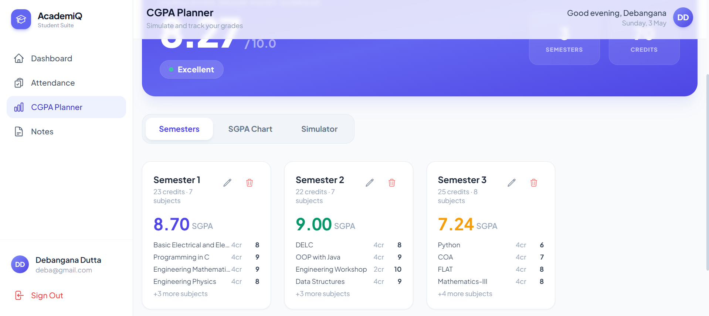 |  | 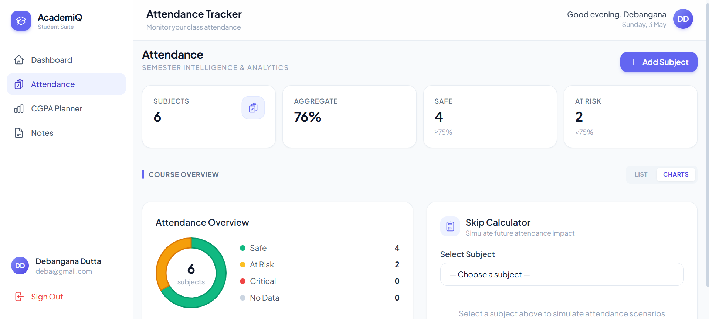 |
| **Data Breakdown**: Granular view of performance metrics across your degree. | **Deep-Dive Logs**: Specific subject attendance trends and percentage health. | **Skip Calculation**: Real-time impact analysis for missing upcoming classes. |

---

## ✨ Core Features
*   **Smart Skip Calculator**: Custom algorithms for attendance safety thresholds.
*   **Predictive Simulation**: Real-time impact analysis for both attendance and CGPA.
*   **Must-Attend Counter**: Real-time recovery logic for "At Risk" subjects.
*   **Rich Organization**: Searchable, color-coded notes vault with pinning.
*   **Security First**: JWT authentication via HTTP-only cookies and XSS protection.

---

## 🛠 Tech Stack
| Layer | Technology |
|-------|-----------|
| **Frontend** | React 18, Vite, Tailwind CSS |
| **State** | React Context API |
| **Charts** | Chart.js + react-chartjs-2 |
| **Backend** | Node.js, Express 4 |
| **Database** | MongoDB Atlas + Mongoose |

---

## 🔗 Live Demo

🚀 **Experience AcademiQ Live:** [https://academiq-xi.vercel.app](https://academiq-xi.vercel.app)

---

## 🚀 Getting Started

Follow these steps to set up and run AcademiQ locally on your machine.

### 1. Clone & Install

```bash
# Clone the repository
git clone [https://github.com/Debangana-Dutta/Academiq.git](https://github.com/Debangana-Dutta/Academiq.git)

# Navigate into the project directory
cd Academiq

# Install all root, frontend, and backend dependencies using the custom setup script
npm run install:all
